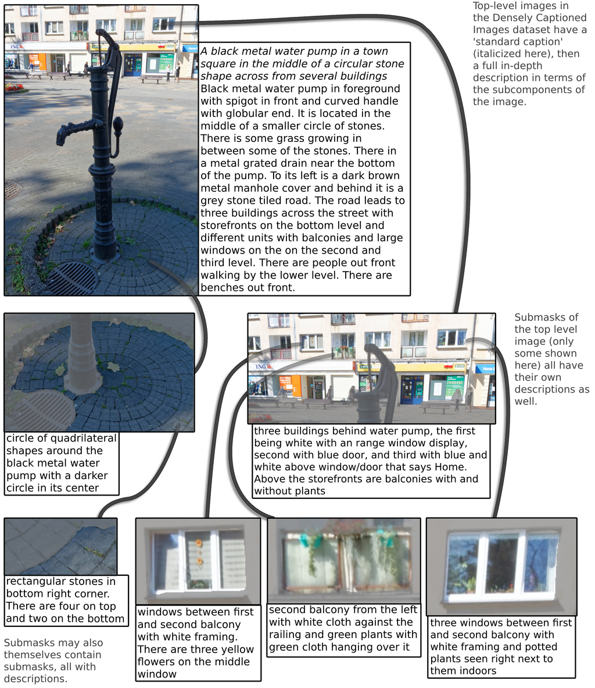
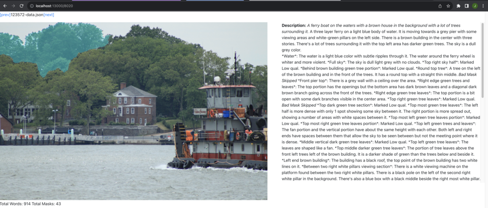

# Densely Captioned Images

This repo contains the code required to use the Densely Captioned Images dataset, as well as the complete reproduction for the **Insert Title And Link** Paper.

For use of the dataset, which includes both for training and evaluation, see the **Dataset** section. For reproduction, which includes data collection, evaluation against other benchmarks, model code, and more, see the **Reproduction** section.

**Note:** Running any of our scripts will initially prompt you for standard data saving locations. Using the defaults should mean that our download scripts work as expected, but if you already have data saved or specific target locations this is how you can override. Config files are then placed in `dataset/config.yaml` and `reproduction/config.yaml`.

If you use this dataset in your work, please credit the initial work here:
```bibtex
@misc{
    author = "us",
    title = "TODO put the real paper in",
}
```

## Dataset

### Details

The Densely Captioned Images dataset, or DCI, consists of 8021 images from [SA-1B](https://ai.meta.com/datasets/segment-anything/), each with a complete description aiming to capture the full visual detail of what is present in the image. Much of the description is directly aligned to submasks of the image.



An example is shown above. In the top left we see the full image of a water pump, with an associated description. The italicized section is collected as a ‘standard caption’, aiming to summarize the full image in about a sentence. The remainder of that first description contains details about the relationship between visible entities in the image, as well as in-depth descriptions of regions that are not described as part of the submasks. All other text describing the image is all associated with submasks of the image. Each submask has its own label (not pictured) and description, and may also contain further submasks. Here for instance we see submasks for windows and balconies as being contained in the submask capturing three buildings in the background.

### Setup

We suggest setting up in an conda environment.

```bash
conda create -n densecaps python=3.10
```

Then navigate to the `dataset` directory and run install
```bash
cd dataset
pip install -e .
```

You can then download the dataset and our reported best models with our download script.

```bash
python dataset/densely_captioned_images/dataset/scripts/download.py 
```

Or download them manually at the following urls.
https://github.com/facebookresearch/DCI/blob/3d95af66c918f0cc24f115c5eeb0d2f66be30872/dataset/densely_captioned_images/dataset/scripts/download.py#L16-L29

### Data

#### CLIP-ready
We provide easy data-loader utilities for the CLIP-ready version of the densely captioned images dataset, wherein all Captions have LLaMA2-generated summaries and negatives that fit inside of the CLIP context limit.

```python
from densely_captioned_images.dataset.impl import get_clip_ready_ds, DenseCaptionedDataset
train_ds: DenseCaptionedDataset = get_clip_ready_ds('train')
valid_ds: DenseCaptionedDataset = get_clip_ready_ds('valid')
```

#### Full

You can preview data from the DCI dataset by running the explorer script:
```bash
pip install flask
python explorer/run_server.py <port>
```

This shows the complete data available from within the `DenseCaptionedImage` class at `http://localhost:port`:



In this view, you can navigate to image by index or by specific ID. The `[prev]` and `[next]` buttons can be used to directly parse through. On screen is the complete description of the image, as well as all submasks. Hovering over words in the text highlights the corresponding mask in the image, as is done here for *"Top most green tree leaves"*.

The `DenseCaptionedImage` class acts as a wrapper around the stored data json, which has the following format:
```yaml
{
    "image": "relative-image-path.jpg",
    "short_caption": "A standard short-form caption for the image",
    "mask_data": {
      "[mask_key]": {
        "idx": "[mask_key]", # Self-reference into mapping
        "outer_mask": "iVBORw0KGgoAAAANSUhE.....", # base64 encoding of the binary mask for this segment
        "mask_quality": 0, # one of 0, 1, or 2 for "ok", "low-quality/uninteresting", or "bad" respectively
        "label": "A short label for the given mask", # omitted if "bad" quality
        "caption": "A long descriptive caption for this given mask", # only for "ok" masks
        "parent": "other_mask_key", # either the parent mask id in the tree, or -1 if parent is the base image
        "requirements": ["list", "of", "children", "masks"] # mask IDs for children masks
        "bounds": [[0, 0], [500, 500]] # TopLeft & BottomRight coords of mask bounds
        "area": 123, # mask size in pixels 
      },
      # ...
    },
    "mask_keys": ["list", "of", "mask_keys", "into", "mask_data"],
    "extra_caption": "Additional long form caption that may catch additional information about layout or from from missing masks",
    "summaries": {
        "base": ["list", "of", "generated", "summaries"],
        # ...
        "[mask_key]": ["list", "of", "generated", "summaries"],
        # ...
    },
    "negatives": {
        # ...
        "[mask_key]": {
            # ...
            "[negative_type]": ["list", "of", "negatives", "generated", "of", "type"],
            # ...
        },
        # ...
    }
}
```

### (CLIP-ready) Densely Captioned Images Test set

The Densely Captioned Images test set comes in a few variations:
- **All Submasks**: Pulls images and all subimages from the test set, and uses their first captions. Key: `all_swaps`
- **All Submasks Pick 5**: Pulls images and all subimages from the test set, and uses their first 5 captions. Key: `all_swaps_pick5`
- **Base**: Only pulls the 112 base images from the test set, alongside their first captions. Key: `base_swaps`
- **Hardest**: Use the same imageset as `all_swaps`, but hardest negative of all generated based on CLIP score. Key: `all_hardest`

All tests report both the CLIP-correct (correct caption prediction compared to rest of batch) and Negative-correct (correct caption prediction compared to a generated negative).

#### Usage

You can also directly reproduce the DCI results for CLIP with the following:
```bash
python dataset/densely_captioned_images/dataset/scripts/run_clip_dense_cap_eval.py 
```

You can also reproduce our results on provided DCI-trained models by running the following in a python shell from the project root.
```python
from densely_captioned_images.dataset.scripts.run_clip_dense_cap_eval import run_dense_cap_on_lora
run_dense_cap_on_lora('models/dci_pick1')
run_dense_cap_on_lora('models/dci_pick1_nl0')
```

So long as you can wrap a model in `CLIPModel`, you can use the `run_dense_cap_on_model` function instead to test your own models.


## Reproduction

This section contains information about reproducing the full set of results from the paper, including training and eval sweeps across all of our datasets.

### Setup

Be sure to follow the dataset setup first, which is required as a prerequisite. Then from the root of this repository:
```bash
cd reproduction
pip install -e .
bash ./clone_dependents.sh
```

This script clones the dependent repos that we run evaluations from, and also applies the patches that we required to get them running.

#### Dataset Download

We provide dataset downloading scripts that install the expected datasets to the default locations. If you change from the default locations, these may not work. They also may not work if resources change. Still, it may work! Run from the root directory.

```bash
bash reproduction/densely_captioned_images/repro/setup_data/dlownload_vl_checklist.sh
python reproduction/densely_captioned_images/repro/setup_data/get_aro.py
```

### Collection

The complete collection flow can be found in `reproduction/crowdsourcing`, with more complete documentation.

### Training

The bulk of the training implementation is contained in the `ClipAndNegTrainer` class in `densely_captioned_images.repro.train.trainer`. This includes computing loss in the single caption and multi-caption cases. Usage can be observed in `densely_captioned_images.repro.train.train_clip`. 

Example sweep scripts can be found in `reproduction/densely_captioned_images/repro/train/sweeps`, and wrappers for the COCO and Localized Narratives datasets are present here too.

### Evaluation

The main entry point for evaluations is `reproduction/densely_captioned_images/repro/eval/run_full_evals.py`, and examples can be seen at `reproduction/densely_captioned_images/repro/eval/sweeps`

### License
DCI code and data are CC-BY-NC licensed, as found in the LICENSE file.
